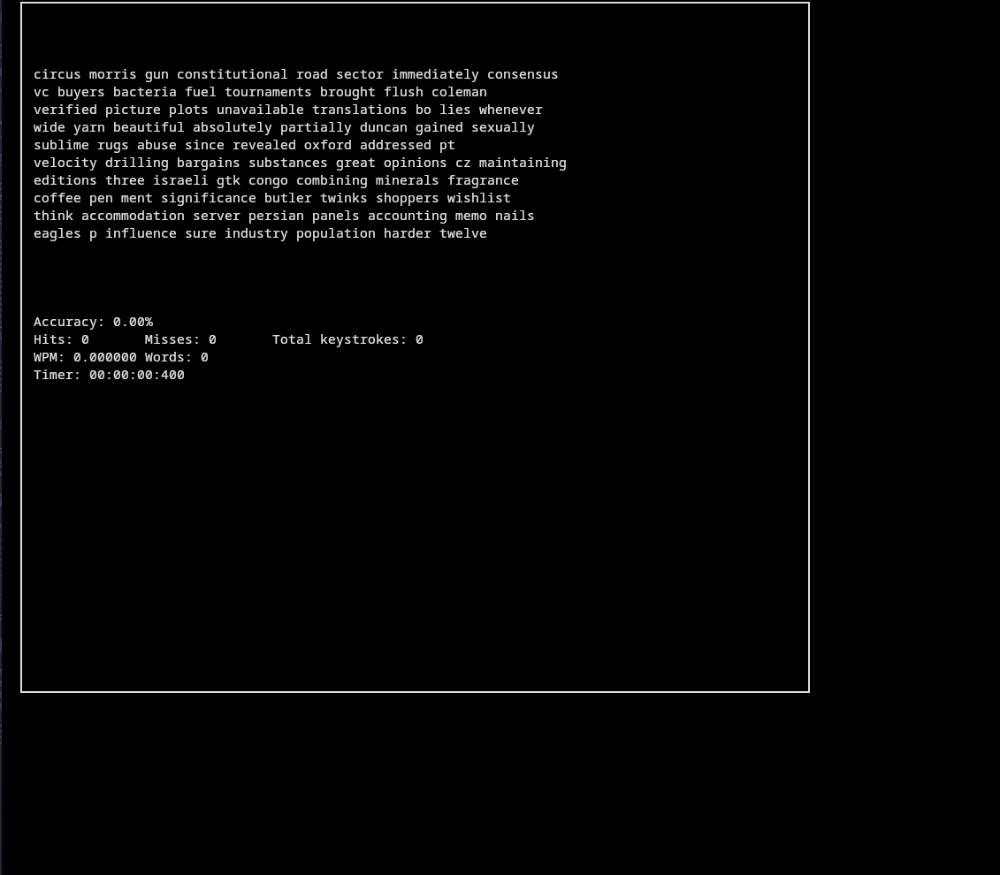

# Type-racer

Something to practice typing, written in C++ using the ncurses library.

# Word List Sources

[Easy](https://www.mit.edu/~ecprice/wordlist.10000)

[Medium](http://www.gwicks.net/dictionaries.htm)

[Hard](https://github.com/jeremy-rifkin/Wordlist)

